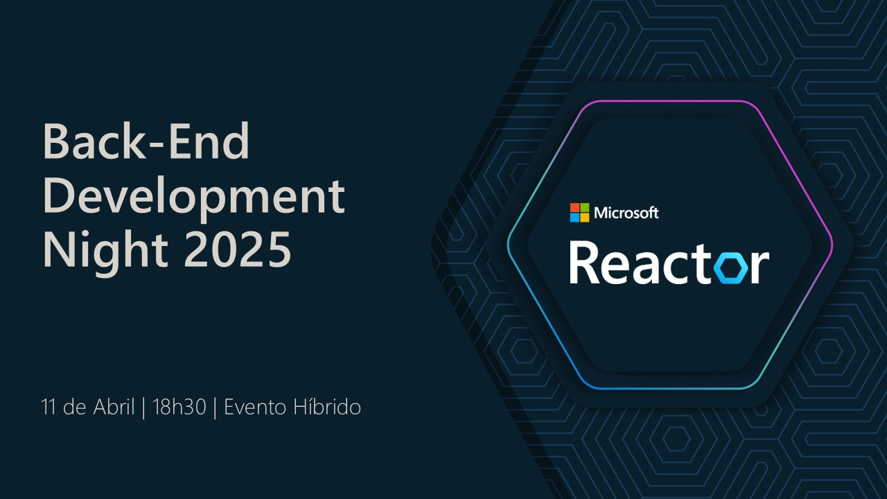

# BackEndDevelopmentNight-2025-04
Fotos e informações gerais sobre o evento "Back-End Development Night 2025", realizado em 11/04/2025 na cidade de São Paulo-SP.

Organizadores:
- **Renato Groffe (Microsoft MVP, Docker Captain, MTAC)**
- **Thiago Bertuzzi (Microsoft MVP)**

Número de participantes: **30 pessoas**

---

Apresentação que aconteceu durante o evento:
* **.NET 10: o que esperar desta nova versão?**

Palestrantes:
- **Renato Groffe (Microsoft MVP, Docker Captain, MTAC)**
- **Thiago Bertuzzi (Microsoft MVP)**

Tecnologias e tópicos abordados: **.NET 10, C# 14, ASP.NET Core, MAUI, WPF, Windows Forms, Azure DevOps, GitHub Actions, macOS, iOS, Docker, Kubernetes, Microsoft Azure, Testcontainers, Terraform, Python, Java, Node.js, Developer Security...**

---

Painel que aconteceu durante o evento:
* **Desenvolvimento Back-End em 2025 - tendências, tecnologias, mercado, dicas de carreira e muito mais!**

Participantes do Painel:
- **Renato Groffe (Microsoft MVP, Docker Captain, MTAC)**
- **Thiago Bertuzzi (Microsoft MVP)**
- **Mayumi Shingaki  (Microsoft MVP)**
- **Milton Camara Gomes (Microsoft MVP, MTAC)**
- **Vinicius Moura (Microsoft MVP)**

Tecnologias e tópicos abordados: **.NET 10, C# 14, ASP.NET Core, MAUI, WPF, Windows Forms, Azure DevOps, GitHub Actions, macOS, iOS, Docker, Kubernetes, Microsoft Azure, Testcontainers, Terraform, Python, Java, Node.js, Developer Security...**

Acesse este [**link**](/img/) para visualizar todas as fotos das apresentações.

Link da transmissão: [**YouTube**](https://www.youtube.com/watch?v=1LxT-i-uPQg)

Este evento foi uma parceria entre a comunidade [**.NET SP**](https://www.meetup.com/dotnet-Sao-Paulo/) e o [**Microsoft Reactor**](https://www.meetup.com/Microsoft-Reactor-Sao-Paulo/).

Formulário utilizado para inscrições: [**Microsoft Reactor**](https://developer.microsoft.com/pt-br/reactor/events/25520/?wt.mc_id=meetup_25520_webpage_reactor)

Local: Microsoft Reactor - Rua Jaceru, 225 - Vila Gertrudes - São Paulo - SP - CEP: 04705-000

Deixamos aqui nossos agradecimentos ao Victor Temple e à Larissa Cyganski pela oportunidade e todo o apoio para promovermos esta edição local do .NET Conf no Microsoft Reactor em São Paulo-SP.

---

